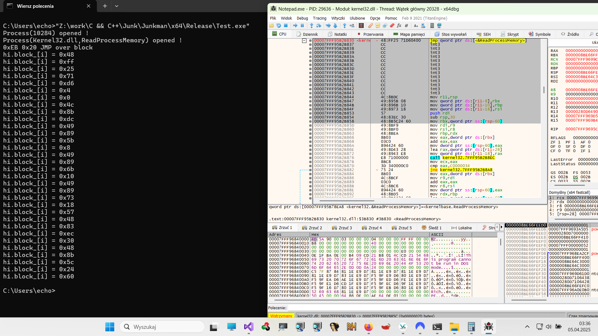

 
<h3>Junkman The Concept. 🤗 </h3> 

Kiedyś obudziłem się rano i idąc do porannej toalety, zastanawiałem się, do czego można jeszcze wykorzystać disassembler HDE (Hacker Disassembler Engine).
Czyli taki, który z reguły służy do obliczania długości instrukcji procesora. Tego typu disassemblery były historycznie wykorzystywane na przykład w technice 
ukrywania punktu wejścia (EPO). Jak wiadomo toaleta, jest najlepszym miejscem, w którym człowiek wpada na genialne pomysły i tak też się stało w tym przypadku.
Otóż wymyśliłem, że wykorzystam HDE do tworzenia śmieciowych instrukcji assmblera, a ściślej mówiąc nie będę ich tworzył tylko kopiował.
Ponieważ będą to bloki instrukcji kopiowane z istniejącego oprogramowania np. systemowego to nie będzie ich można wykorzystać do statycznej detekcji, poza tym będą 
to instrukcje trybu użytkownika, które jak wiadomo pasują do programów trybu użytkownika. 
Jako że, różne wichry targają moim życiem, pomysł z toalety umarł na lata aż znalazłem odpowiednie HDE dla x64 (którego nie chciało mi się pisać).

<h3>Rys historyczny.</h3>

Ogólnie silniki polimorficzne składają się z kilku głównych komponentów. 
Assembler lub dissambler, który pozwala tworzyć lub modyfikować kod assmblera. 
Permutator, który zmienia warianty instrukcji assemblera np. 
<pre>
mov eax, 1337
</pre>
na 
<pre>
mov eax, 1330, 
add eax, 7
</pre>
Komponent który zminia losowo wykorzystywane rejestry procesora i bloki kodu — przy czym właściwie prawie każda pojedyncza instrukcja może być traktowana jako osobny blok podstawowy. 
Opcjonalne elementy, które np. wykrywają emulatory, debugery etc. 
Komponent, który tworzy losowe instrukcje, aby zwiększyć losowość en/dekryptora. 
Załóżmy, że tak wygląda podstawowy dekryptor bez komponentu, który tworzy losowe instrukcje.

<pre>
[main_basic_block_a]
init: 
[basic_block_a]
(permutatoion) mov r, base_of_code
[basic_block_b]
(permutatoion) mov r, size_of_code
[basic_block_c]
(permutatoion) mov r, key
[main_basic_block_b]
loop_labler:
    (permutatoion) decrypt code
	(permutatoion) inc offset
	(permutatoion) loop
[main_basic_block_c]
redirect:
    (permutatoion) jmp 2_decrypted_code
</pre>
Tak natomiast wygląda dekryptor z komponentem, który tworzy losowe instrukcje.

<pre>
[main_basic_block_a]
(permutatoion) jmp init
trash asm instructions
...
...
init: 
[basic_block_a]
(permutatoion) mov r, base_of_code
[basic_block_b]

(permutatoion) jmp over_a
trash asm instructions
...
...
over_a:

(permutatoion) mov r, size_of_code
[basic_block_c]
(permutatoion) jmp over_b
trash asm instructions
...
...
over_b:
(permutatoion) mov r, key
[main_basic_block_b]
loop_labler:
    (permutatoion) decrypt code
	(permutatoion) jmp over_c
trash asm instructions
...
...
over_c:
	(permutatoion) inc offset
	(permutatoion) loop
[main_basic_block_c]
redirect:
    (permutatoion) jmp over_d
trash asm instructions
...
...
over_d:
    (permutatoion) jmp 2_decrypted_code
</pre>

Ogólnie rzecz biorąc, możemy wstawić do en/decryptora dowolną ilość bloków "śmieciowych instrukcji".  
Historycznie te bloki instrukcji były tworzone oczywiście w językach niskiego poziomu i kluczowe jest tu słowo "tworzone" ponieważ tworzenie losowych instrukcji 
powodowało na przykład, że w aplikacjach trybu użytkownika pojawiały się uprzywilejowane instrukcje trybu jądra i ogólnie charakterystyka takich bloków była kompletnie nielogiczna.
Wykorzystując HDE możemy tworzyć bloki instrukcji, które są zgodne z kontekstem, w którym działa aplikacja, możemy również omijać określone instrukcje czy bloki kodu. Na przykład 
instrukcje INT 3 w przypadku procesów, prologi, epilogi, shadow stack i tak dalej.

<h3>Obrazki</h3>   

<h3>To do</h3>
<ul>
<li>Implementacja File.cpp</li>
<li>Implementacja DetectAndSkip</li>
<li>Oczywiście refactoring i fixy :lol:</li>
<li>Poprawka README.md, może kiedyś będzie mi się chciało to napisać</li>
</ul>
